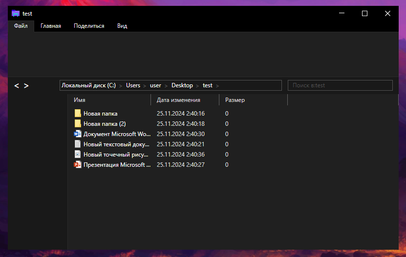
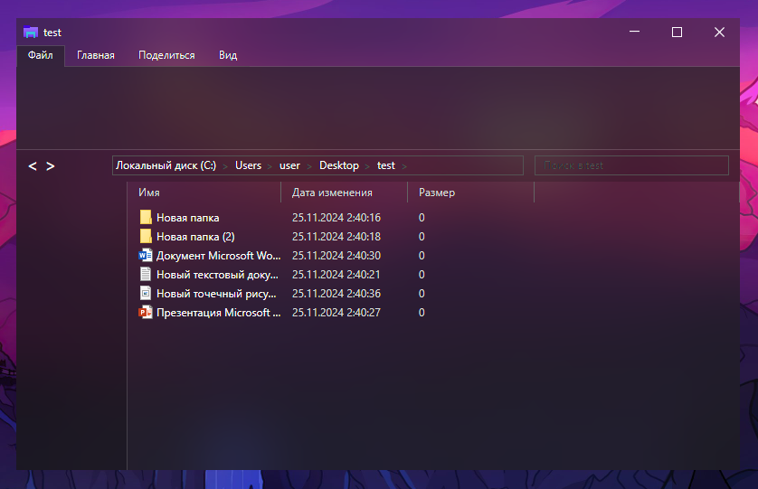

# Файловый менеджер (ранний прототип)
Ранний прототип файлового менеджера на C# и Avalonia, копирующий интерфейс проводника Windows.
На текущий момент реализован только просмотр файлов в виде списка, переход по директориям и открытие файлов.
Подразумевается регистрация в качестве основного файлового менеджера через реестр в Windows.
Для ускорения открытия окон программа запускается в фоновом режиме. Для открытия нового окна новые процессы отправляют данные основному процессу. Это необходимо, т.к. инициализация Avalonia при запуске программы занимает много времени и основное окно открывается с задержкой.

## Серверная часть часть (AttendanceAPI)
API для взаимодействия с базой данных MS SQL Server на ASP.NET
